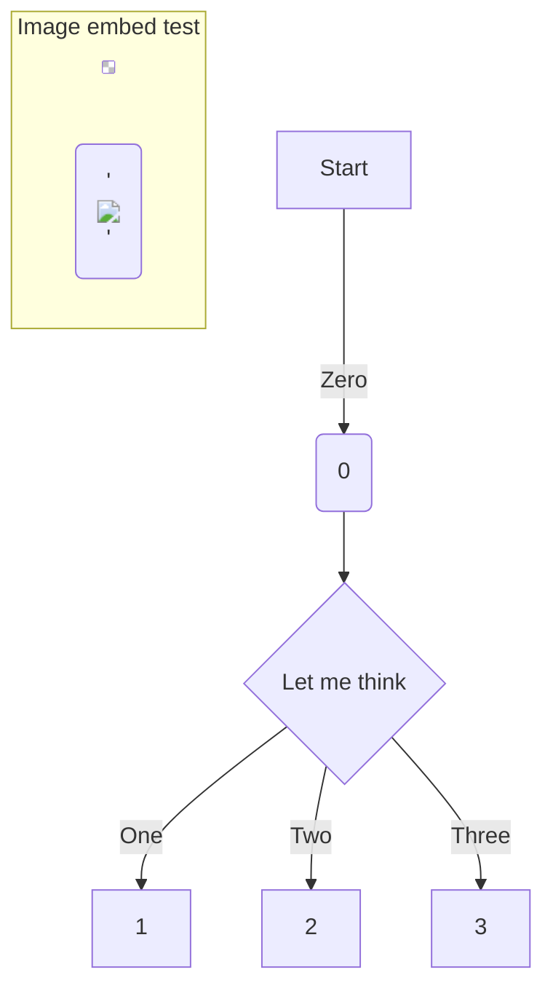

```mermaid
flowchart TD

A["Start"] -->|Zero| B(0)

B --> C{Let me think}

C -->|One| D[1]

C -->|Two| E[2]

C -->|Three| F[3]

subgraph s1["Image embed test"]

n2@{ img: "data:image/png;base64,iVBORw0KGgoAAAANSUhEUgAAAAgAAAAIAQMAAAD+wSzIAAAABlBMVEX///+/v7+jQ3Y5AAAADklEQVQI12P4AIX8EAgALgAD/aNpbtEAAAAASUVORK5CYII" }
n3('<img src="/mini-cnc/assets/test_raster.png" min-height="300px" min-width="300px" />');

end
```

working:

```mermaid
flowchart LR
    subgraph Border
        subgraph vNet[HUB]
            direction TB
            Subnet("Subnet <br /> 10.1.1.0/24")
            Subnet("Subnet <br /> 10.1.1.0/24")
            vNetIcon["<br /><img class='Icon' src='assets/test_raster.png' />..."]
        end
        
    end
%% Defining Class Styles
classDef Border fill:#fff,stroke:#fff,stroke-width:4px,color:#fff,stroke-dasharray: 5 5;
classDef vNet fill:#dfe5f3,height:120px,stroke:#4698eb,stroke-width:2px,color:#000,stroke-dasharray: 8 4,width:214px;
classDef Subnet fill:#fff,stroke:#4698eb,stroke-width:1px,color:#000,stroke-dasharray: 4 8;
classDef Icon margin:0px, stroke-width:0px, padding:0px, fill:#000, position:absolute, bottom:0px, right:0px;

%% Custom Styles

%% Assigning Nodes to Classes
class Border Border;
class vNet vNet;
class Subnet Subnet;
class vNetIcon Icon;
```
