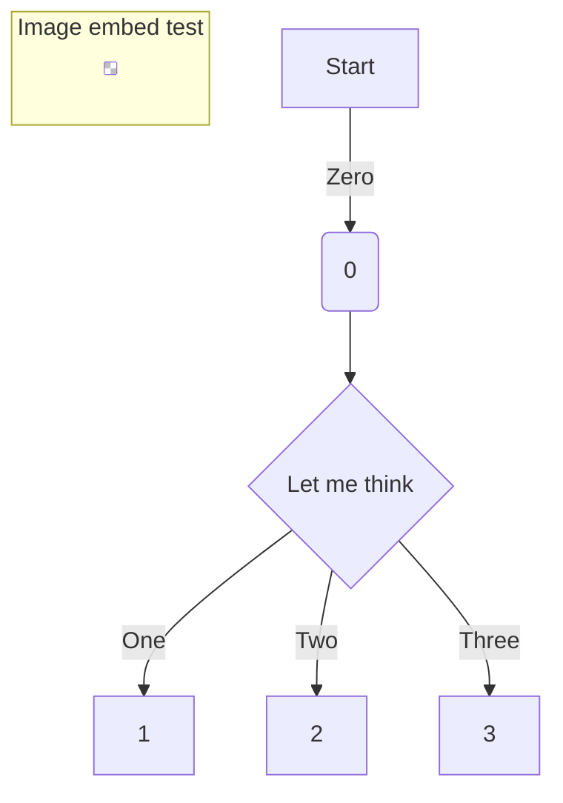

# order of operations
- [Mini CNC Induction - South London Makerspace](https://youtu.be/y_9FyzbRqF4)
## prep in vcarve
- Left sidebar
    - measure w calipers, round down
    - scale design on
    - material settings to correct material
## Carving
- Power on PC using front power button on the PC case
- black switch is power which should always be on anyway
- vcarve
    - toolpath
        - pick correct tool
            - check tool diameter by tips
                - spin bit if odd number of flutes
                - don't put pressure cos could chip bits
            - check number of flutes
            - if flutes don't match, don't edit, just pick correct diameter and type, then select and THEN press edit to change flutes
        - pocket vs profile
            - *profile* for second cut
                - can be slightly deeper to make a border
                    - but not too much if a thin bit
                - go down by half diameter
                - *climb* is good as it makes the tool self-tightening
        - save with sensible name
            - ie bit info, which step
    - press preview all toolpaths
    - use clock icon ⏰ to check time taken
    - save
- machine
    - 🔌 Power on Isel CNC machine from power socket switch
    - turn on grey switch, black switch stays on
- Linux
    - ⌨️ press Login to Linux
        - username: cnc
        - password: cnc
    - Start LinuxCNC from desktop shortcut ‘CPM2018’
- Copy your GCode onto the PC from a USB stick
    - or use network drive at `/home/cnc/`
- machine
    - Touch your keyfob in to the tool control box on the right rear corner of the machine to begin your CNC session
    - Release the Emergency-Off switch on the front panel of the machine by turning clockwise
        - Power on the machine with the green POWER button next to the Emergency-Off switch
    - press "cover" while lifting lid
    - Home all the axes
        - it's done when all numbers go to zero
    - clamps
        - one clamp on each side
        - use hex key to tighten while clamps are fully open (anticlockwise)
        - close them
        - if you can flick it open with one finger it's too loose
        - use shims to squeeze vertically if it isn't tight
            - there are different sizes of shim
- linuxCNC
    - connect with orange button
    - home machine
- collet
    - measure *shank* diameter of tool not bit diameter
    - collet should say diameter on size
    - ! check collet isn't damaged
    - collet into collet nut
        - ! debris might cause it to be off centre so remove that
- machine
    - Insert collet and snug down
        - tool into collet
        - 1mm or so from flute
        - tighten hex key above collet nut with torque wrench
            - using hook
            - until wrench fully folds to side
    - Check spindle speed and match to linuxCNC
        - instruction number 6 has a code which u match to the label on the motor
- linuxCNC
    - ! Whenever u open machine linuxCNC gets disconnected so press orange on button to start again
    - touch off x y z on stock using arrow keys
        - raise jog speed slider initially to do this faster until you close
            - ! then slow down to avoid crash
        - machine:
            - ! for z homing, open and check that it doesn't spin too easily, so it's all the way down
- Run your program with no stock well above the bed to make sure movements look correct
- machine:
    - put hand over emergency stop and P key to pause
    - turn on Henry hoover
- Touch off the tool in the corner or middle on all 3 axes on your stock, depending on where you set the XY datum position in your design software.
- Turn vacuum on
- machine
    - turn on hoover
## changing bits
- move bed out the way
- move bit holder up
- do NOT turn off machine
- can turn off Henry hoover
- open lid
- use hook to loosen bit holder
## end
- Turn vacuum off
- Press in the Emergency-Off switch to disable the machine
- Close LinuxCNC application
- Safely shutdown the PC
- Remove cutting tool and collet and place back in their appropriate locations
- **Clean the machine carefully and remove chips and dust deposits with a vacuum **, the axes can be moved by hand when the machine is powered off to get underneath the axes. To protect the viewing windows from scratching, use the provided cloth.
- Power off the Isel CNC from the power socket switch
- Ensure the cover to the machine is left closed
- Touch your keyfob in to the tool control box on the right rear corner of the machine to end your CNC session
# types
- end mill
    - square bottom corners
    - clear material faster
- ball mill
    - rounded sides
    - small step over; slower
    - more detail
    TODO: INSERT IMAGE
- how many flutes?
    - 2 flutes takes off material faster but not as precisely, good for first passes
# settings
- speed (rotation)
    - set via knob at top
- feed rate
    - set by program
    - n too slow: rubs, heats up bit, fire risk
    - mostly set by material settings in orogram
- multiple lighter passes is always safer
